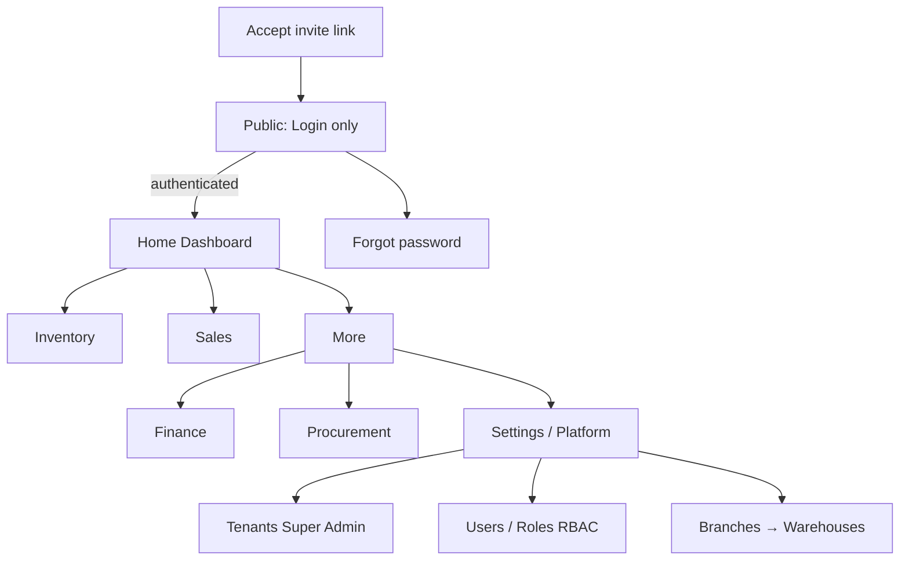
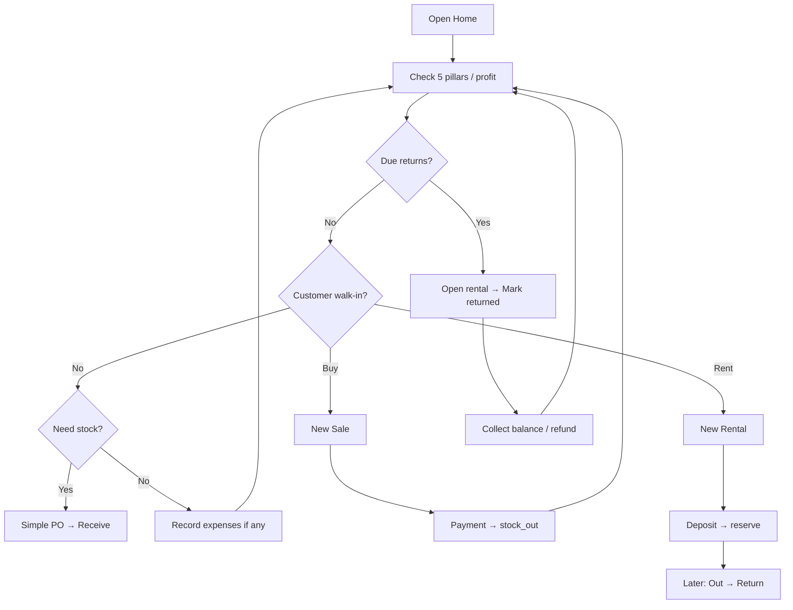
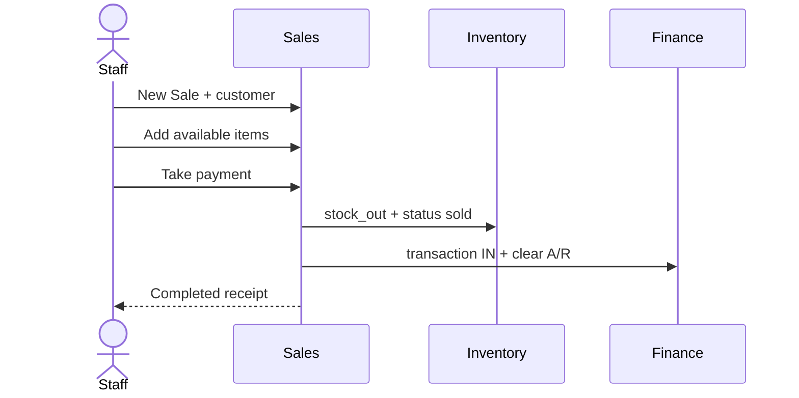
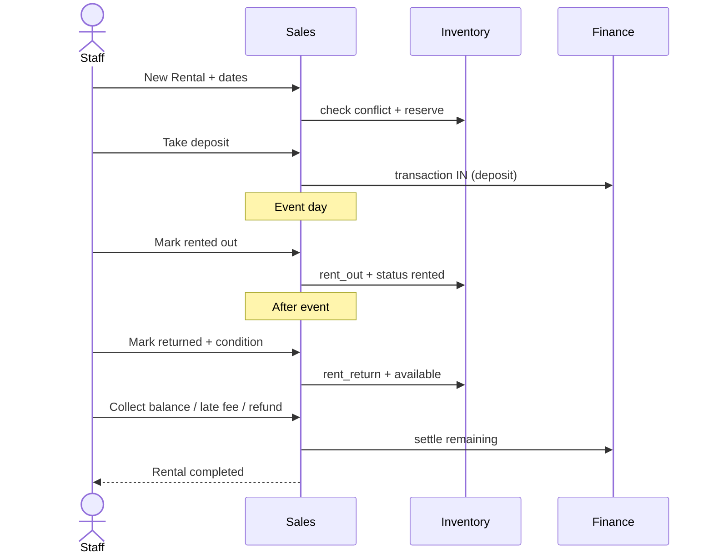
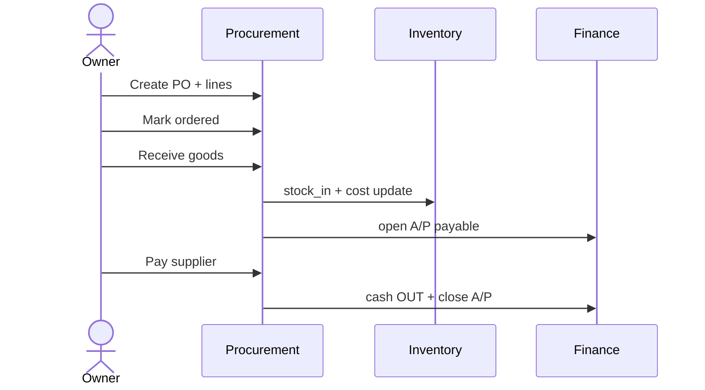
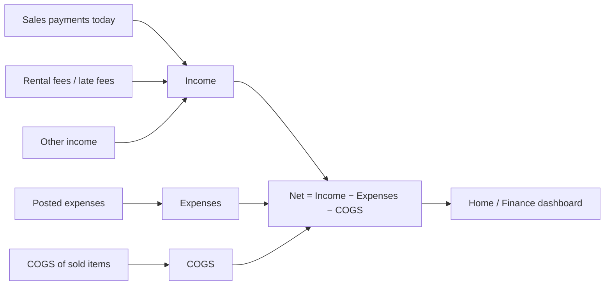
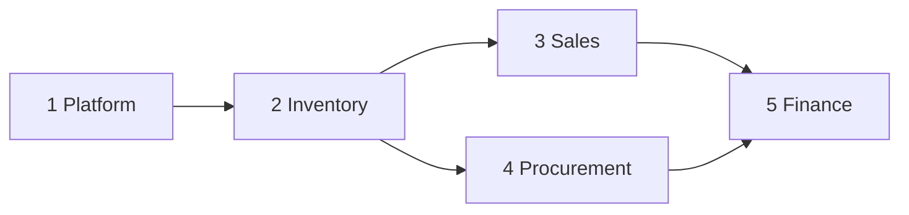

# Application flows — end-to-end

Step-by-step charts for bridal shop daily work.

---

## 1. Master navigation

---

## 2. Daily owner loop

---

## 3. Sale happy path

---

## 4. Rental happy path

---

## 5. Procurement → stock → finance

---

## 6. End-of-day profit check

---

## 7. Module dependency (build order for agents)

Build/implement in this order so FKs and flows stay correct.
