# Application flows — end-to-end

Step-by-step charts for bridal shop daily work. **v2 — corrected** against
[`specs/review/01-spec-review.md`](../review/01-spec-review.md) and the decisions in
[`02-decisions.md`](../review/02-decisions.md).

---

## 1. Module dependency — build order

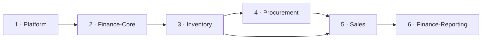

Finance-Core comes **second**, not last: `sales_order_payments` and
`procurement_supplier_payments` hold foreign keys into `finance_accounts`, so the
v1 order was circular (defect A4 · ADR-007).

---

## 2. Master navigation

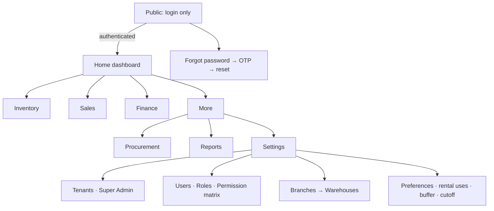

No public sign-up. No invite route. Language and direction come from
`tenants.default_language_id` after authentication.

---

## 3. Daily owner loop

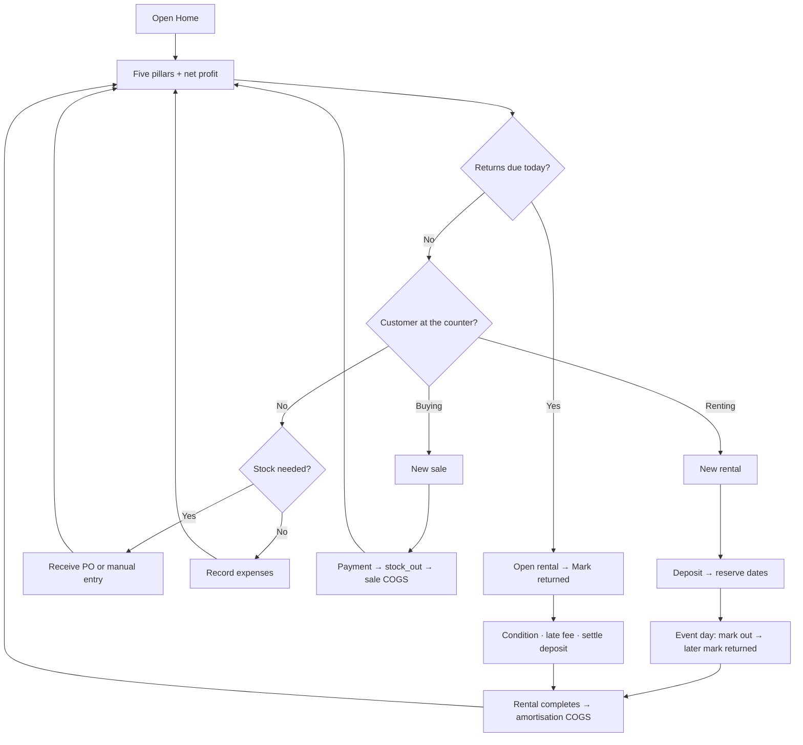

---

## 4. Locale and direction


Numbers, SKUs, currency amounts and dates stay LTR inside RTL text.

---

## 5. User creation — tenant-bound, multi-role

```mermaid
sequenceDiagram
  actor Admin as Owner / Super Admin
  participant UI as Users screen
  participant DB
  Admin->>UI: Open Users → Create (drawer)
  Note over UI: Drawer opens right in LTR, left in RTL
  Admin->>UI: Tenant * (Super Admin picks; Owner locked to own)
  Admin->>UI: Name, email or phone, password, default branch
  Admin->>UI: Roles multi-select (1..N)
  UI->>DB: users row + one user_roles row per role
  DB-->>UI: unique (user_id, role_id, coalesce(branch_id,0))
  UI-->>Admin: User ACTIVE immediately — no invitation sent
```

---

## 6. Procurement → inventory → payable

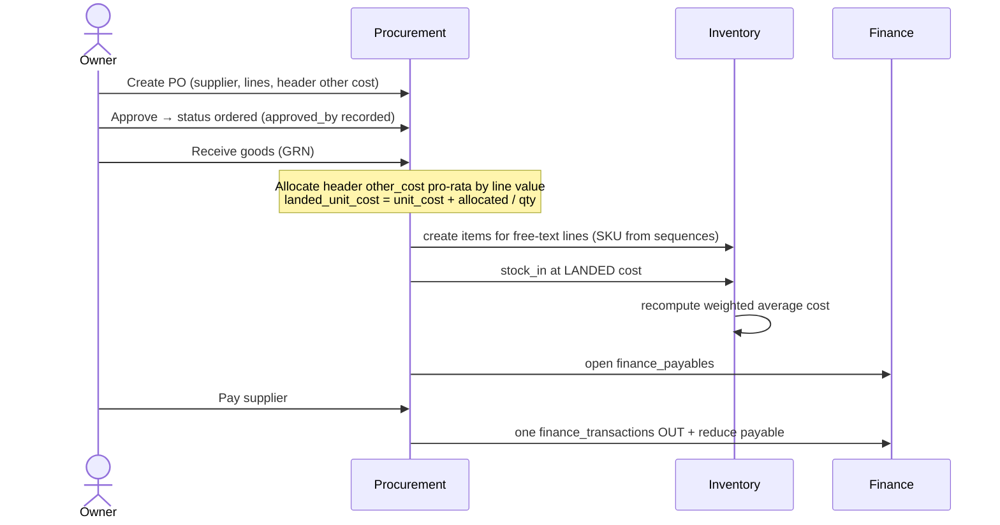

Voiding a posted GRN writes reversing stock rows and a reversing payable — it is
never an in-place edit (ADR-005).

---

## 7. Sale happy path

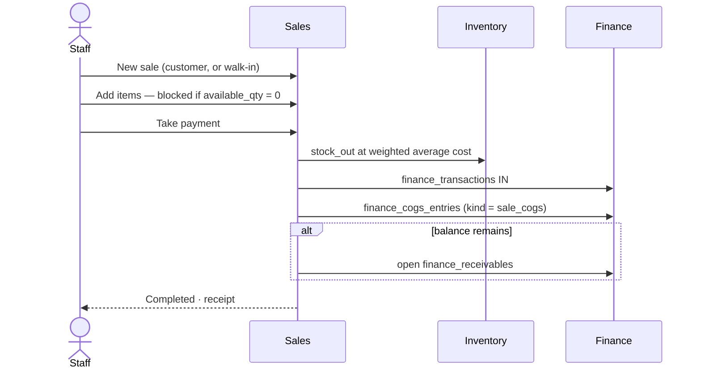

---

## 8. Rental lifecycle — deposits, dates, cost

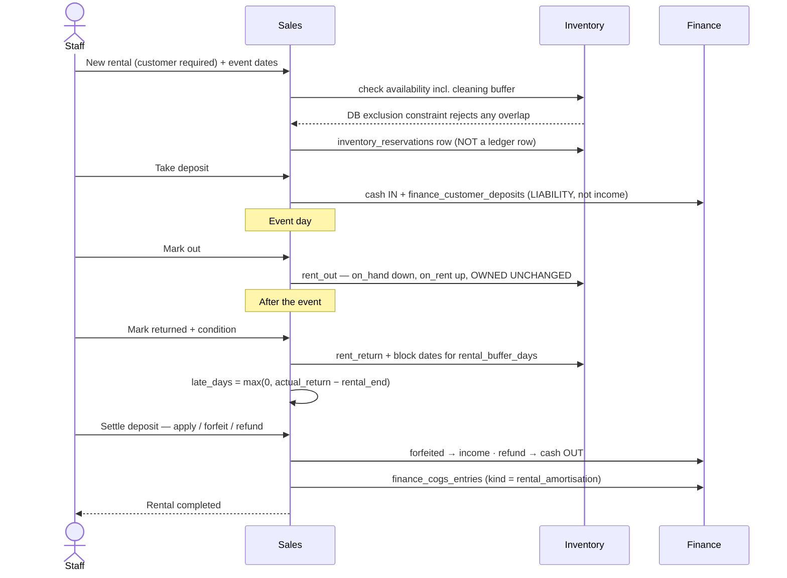

**Rental amortisation** = `acquisition_cost ÷ expected_rental_uses`, accumulated in
`inventory_items.amortised_cost_to_date` and capped at acquisition cost. Once the
dress has paid for itself, further rentals carry zero COGS (ADR-002).

---

## 9. Rental gone wrong — damage or loss

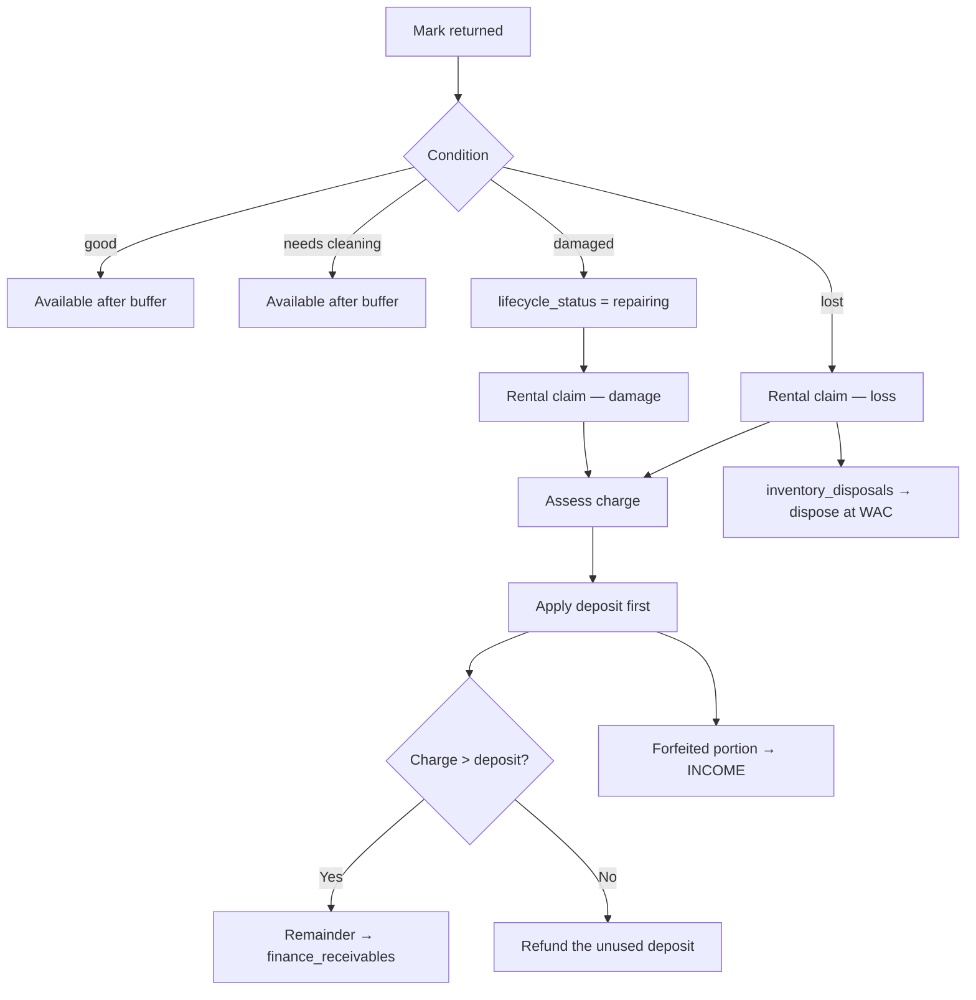

---

## 10. Sale return → refund → restock

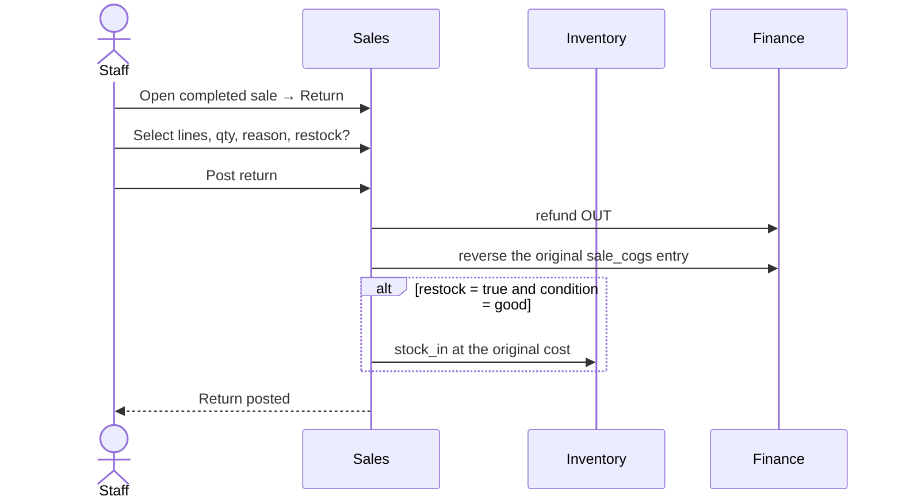

A **sale return** (refund + restock of sold goods) is a different document from a
**rental return** (an order lifecycle transition). v1 called both "return" (defect C7).

---

## 11. Inventory movements — the corrected ledger

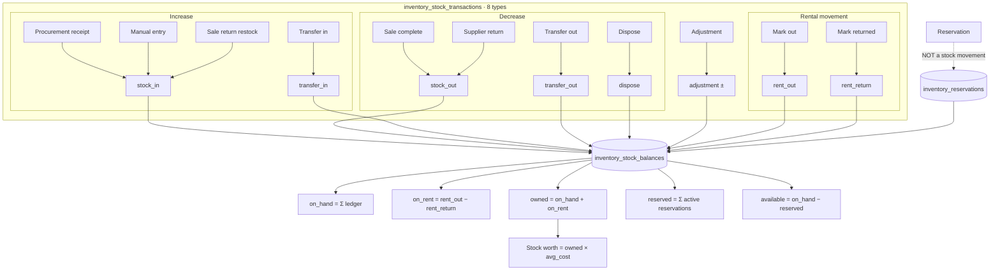

Two corrections are visible here:

- **`reserve` and `release` no longer exist as ledger types.** Reservations are their
  own table; v1 made reserving a dress *reduce stock* and then subtracted it again
  for availability (defect B2).
- **Valuation uses `owned`, not `on_hand`.** A gown at a wedding is still an asset;
  v1's total stock worth collapsed every busy weekend (defect B3).

---

## 12. Weighted average cost

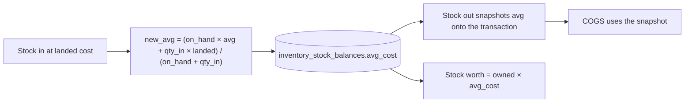

---

## 13. End-of-day profit

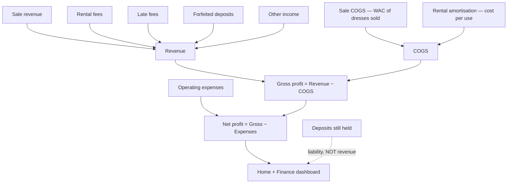

All filtering is on `business_date`, derived from `tenants.timezone` and
`tenant_settings.day_cutoff_time` — so a sale rung up at 00:30 lands on the correct
trading day (ADR-011).

---

## 14. Correction — void by reversal

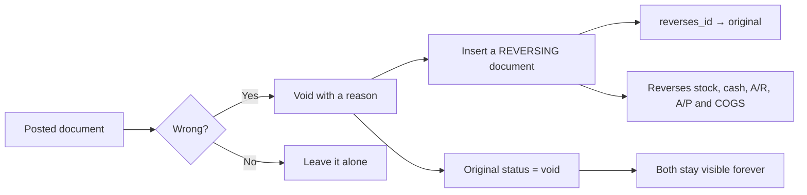

Nothing posted is ever edited, and nothing is ever deleted — in any module (ADR-005).
