# Application flows — end-to-end

Step-by-step charts for bridal shop daily work.

---

## 1. Master navigation

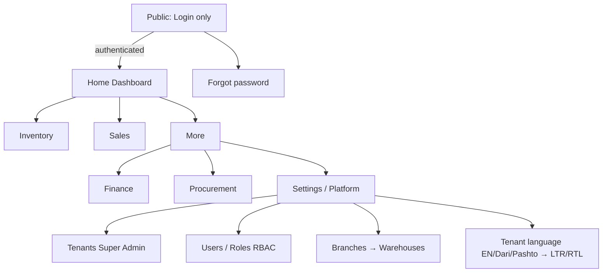

---

## 2. Daily owner loop

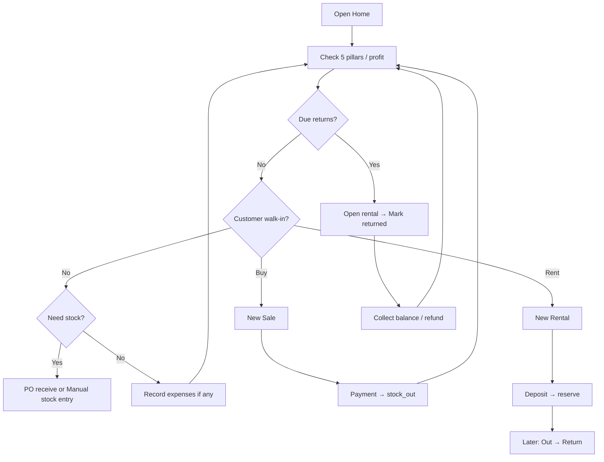

---

## 3. User creation (tenant-bound, multi-role)

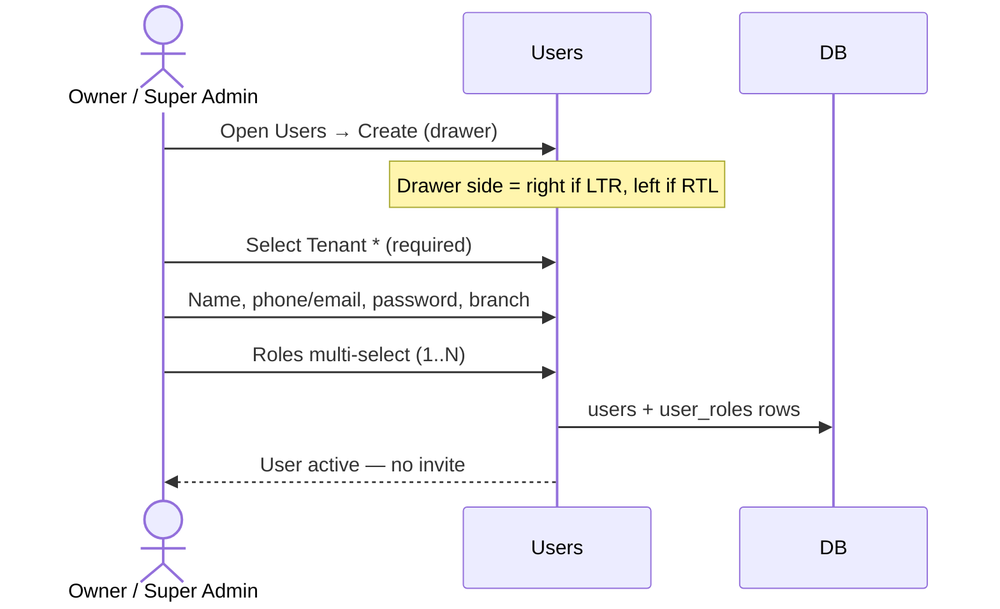

---

## 4. Locale / direction

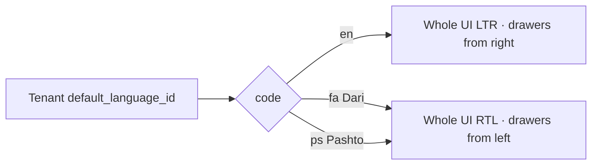

---

## 5. Sale happy path

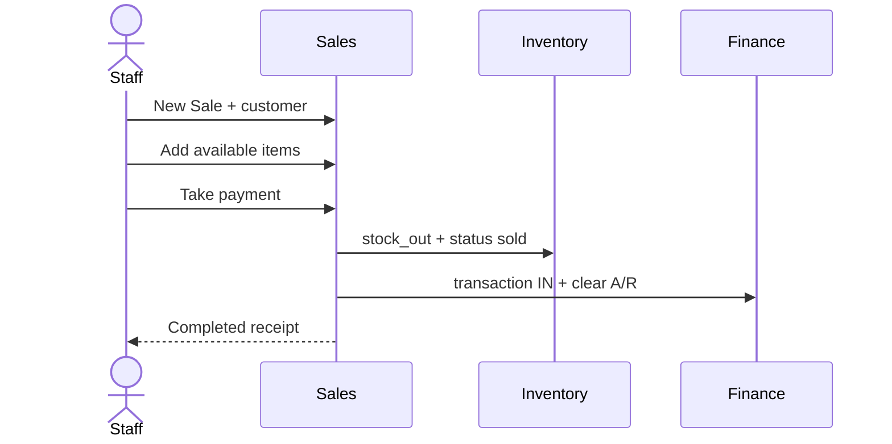

---

## 6. Rental happy path

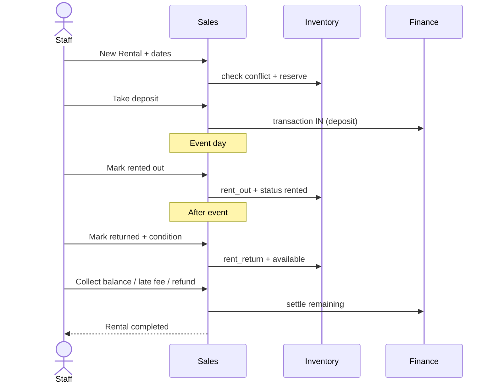

---

## 7. Sales return → restock

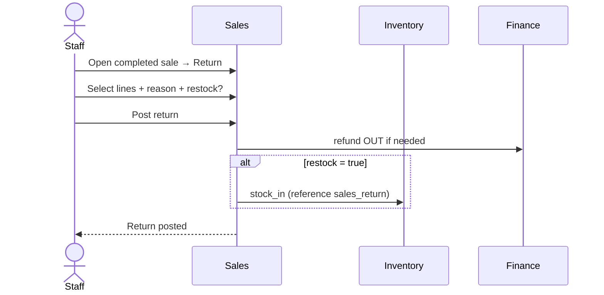

---

## 8. Inventory movements

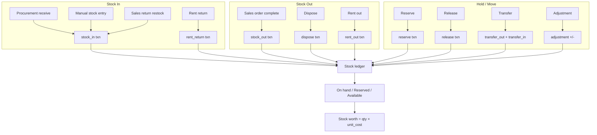

---

## 9. Procurement → stock → finance

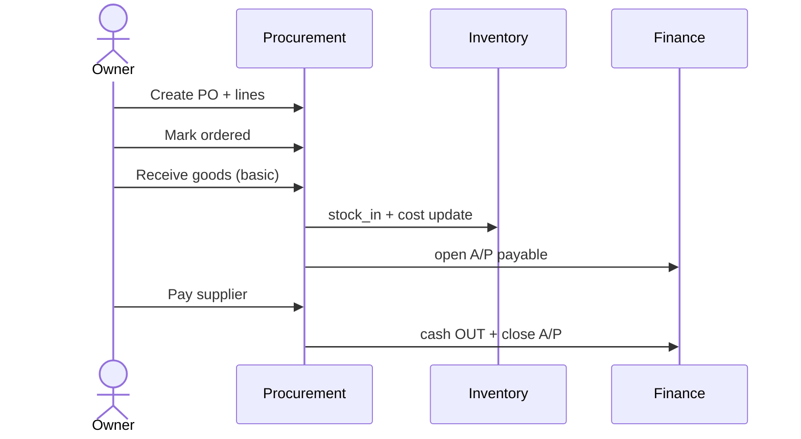

---

## 10. Manual stock entry

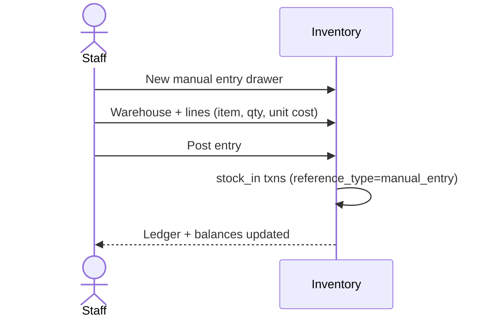

---

## 11. Adjust / Dispose

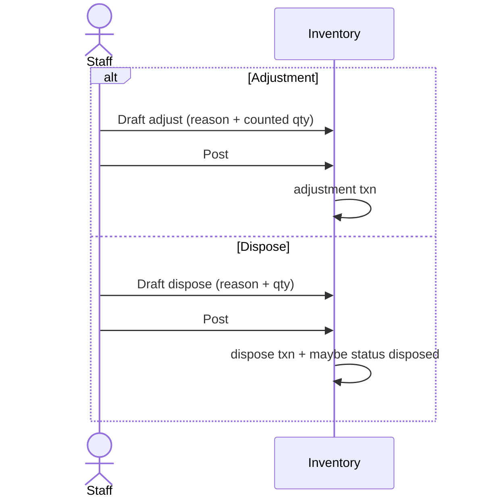

---

## 12. End-of-day profit check

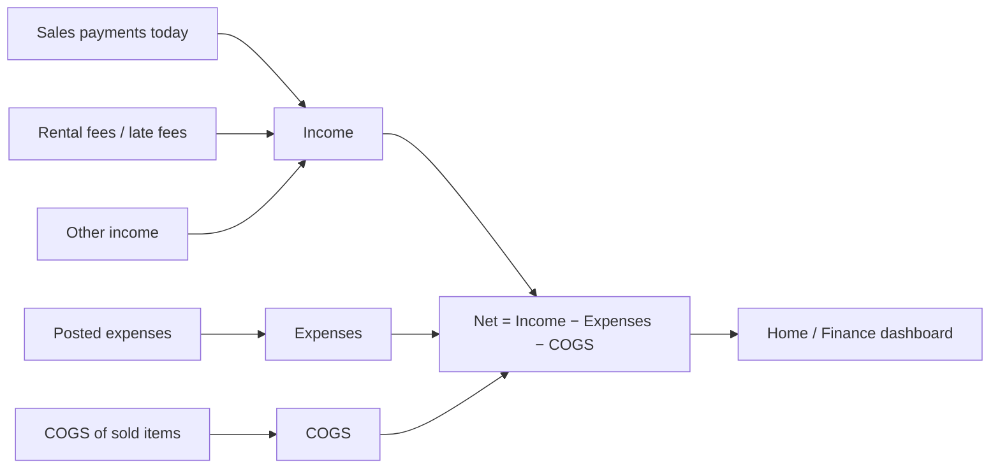

---

## 13. Module dependency (build order for agents)

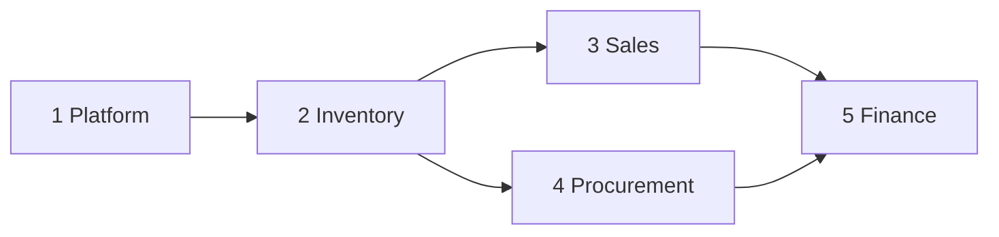

Build/implement in this order so FKs and flows stay correct.
