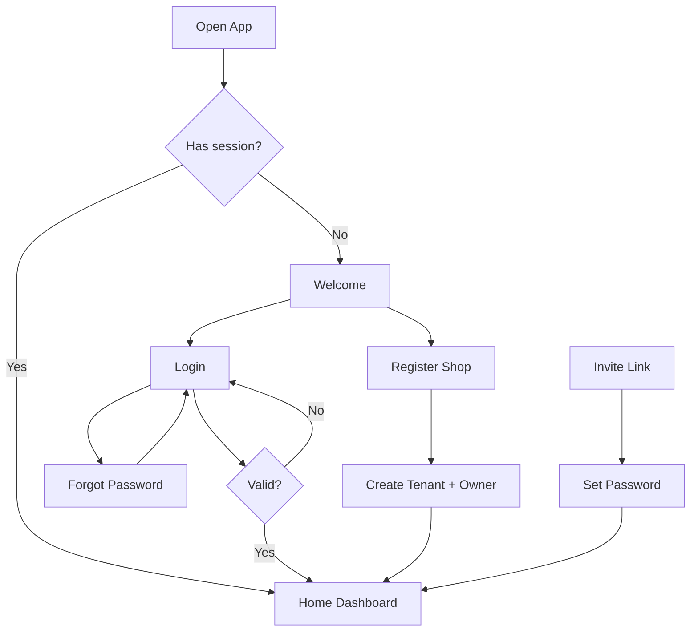

# Wireframes — Auth (Login / Register)

Mobile-first · bridal shop staff & owner

---

## Page order

1. Splash / Welcome  
2. Login  
3. Forgot password  
4. Register shop (new tenant)  
5. Accept invite (existing staff)

---

## Flow



---

## 1. Welcome (first open)

```
┌─────────────────────────┐
│                         │
│      [ BOMS LOGO ]      │
│   Bridal Shop Manager   │
│                         │
│  Manage dresses, rentals│
│  sales & daily profit   │
│                         │
│  ┌───────────────────┐  │
│  │   Login to shop   │  │
│  └───────────────────┘  │
│  ┌───────────────────┐  │
│  │  Register new shop│  │
│  └───────────────────┘  │
│                         │
│  Language: EN | دری | پښ│
└─────────────────────────┘
```

---

## 2. Login

```
┌─────────────────────────┐
│  ← Back                 │
│                         │
│      [ BOMS LOGO ]      │
│         Login           │
│                         │
│  Phone or Email         │
│  ┌───────────────────┐  │
│  │                   │  │
│  └───────────────────┘  │
│  Password               │
│  ┌───────────────────┐  │
│  │ ••••••••      👁  │  │
│  └───────────────────┘  │
│                         │
│  [ ] Remember me        │
│  Forgot password?       │
│                         │
│  ┌───────────────────┐  │
│  │      Sign in      │  │
│  └───────────────────┘  │
│                         │
│  No shop yet? Register  │
└─────────────────────────┘
```

**UX notes:** large taps · phone-first login (shop staff often have no email habit) · clear error under field · RTL ready.

---

## 3. Forgot password

```
┌─────────────────────────┐
│  ← Back                 │
│  Reset password         │
│                         │
│  Enter phone or email   │
│  linked to your account │
│                         │
│  ┌───────────────────┐  │
│  │                   │  │
│  └───────────────────┘  │
│                         │
│  ┌───────────────────┐  │
│  │   Send reset code │  │
│  └───────────────────┘  │
│                         │
│  --- after send ---     │
│  Code   [ _ _ _ _ _ _ ] │
│  New password           │
│  Confirm password       │
│  [ Save new password ]  │
└─────────────────────────┘
```

---

## 4. Register shop (tenant + owner)

Step 1 → Shop info · Step 2 → Owner account · Step 3 → Done

```
┌─────────────────────────┐
│  ←  Create your shop    │
│  ●───●───○  Step 1/3    │
│                         │
│  Shop name *            │
│  ┌───────────────────┐  │
│  │ Al Dubai Bridal   │  │
│  └───────────────────┘  │
│  Shop code * (SKU)      │
│  ┌───────────────────┐  │
│  │ ADF               │  │
│  └───────────────────┘  │
│  Phone *                │
│  City / Address         │
│  Default currency ▾ AFN │
│  Business type          │
│  ( ) Sale  ( ) Rental   │
│  (•) Both               │
│                         │
│  ┌───────────────────┐  │
│  │      Continue     │  │
│  └───────────────────┘  │
└─────────────────────────┘
```

Step 2: owner name, phone/email, password.  
Step 3: success → “Add first dress” or “Go to home”.

---

## 5. Accept invite

```
┌─────────────────────────┐
│  Join Al Dubai Bridal   │
│  Invited as: Cashier    │
│                         │
│  Your name              │
│  Set password           │
│  Confirm password       │
│                         │
│  [ Join shop ]          │
└─────────────────────────┘
```
