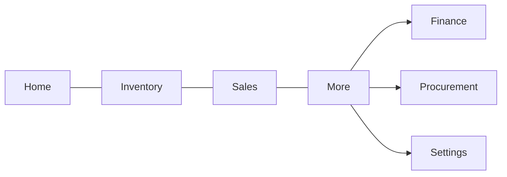
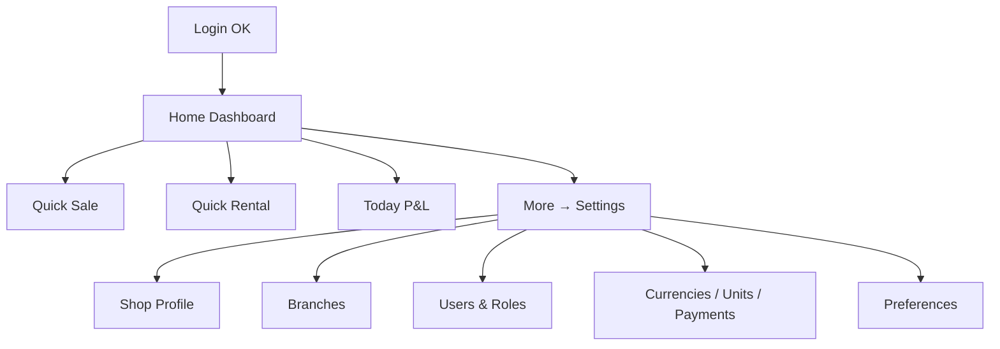

# Wireframes — Platform / Settings / Tenant

Home shell · tenant settings · branches · users · master data

---

## Page order

1. App shell (bottom nav)  
2. Home dashboard  
3. Settings hub  
4. Shop profile  
5. Branches & warehouses  
6. Users & roles  
7. Currencies / units / payment methods  
8. Business preferences  

---

## App shell flow



**Bottom tabs (mobile):** Home · Inventory · Sales · More  
Desktop: left sidebar with same modules.

---

## Flow



---

## 1. Home dashboard (owner view)

```
┌─────────────────────────┐
│ Al Dubai Bridal    🔔 👤│
│ Today · Branch: Main ▾  │
│─────────────────────────│
│ ┌──────┐ ┌──────┐       │
│ │Profit│ │ Cash │       │
│ │ +2.4k│ │ 18.2k│       │
│ └──────┘ └──────┘       │
│ ┌──────┐ ┌──────┐       │
│ │  A/R │ │  A/P │       │
│ │ 3.1k │ │ 1.2k │       │
│ └──────┘ └──────┘       │
│                         │
│ Quick actions           │
│ [ + Sale ] [ + Rent ]   │
│ [ + Expense ] [ Stock ] │
│                         │
│ Today                     │
│ • 3 sales · 2 rentals   │
│ • 1 dress due return    │
│ • 2 low stock alerts    │
│                         │
│ Due returns (tap)       │
│ 👗 Sara — due today     │
│ 👗 Fatima — due Fri     │
│─────────────────────────│
│ 🏠  📦  💳  ☰           │
└─────────────────────────┘
```

---

## 2. Settings hub

```
┌─────────────────────────┐
│  Settings               │
│─────────────────────────│
│  Shop profile        ›  │
│  Branches & warehouses› │
│  Users & roles       ›  │
│  Currencies          ›  │
│  Units               ›  │
│  Payment methods     ›  │
│  Payment terms       ›  │
│  Business preferences›  │
│  Language / RTL      ›  │
│  Audit log           ›  │
│─────────────────────────│
│  Logout                 │
└─────────────────────────┘
```

---

## 3. Shop profile

```
┌─────────────────────────┐
│ ← Shop profile          │
│  [ Logo upload ]        │
│  Name: Al Dubai Bridal  │
│  Code: ADF              │
│  Phone / Email / Web    │
│  Address                │
│  Default currency: AFN  │
│  [ Save ]               │
└─────────────────────────┘
```

---

## 4. Branches list → Add branch

```
┌─────────────────────────┐
│ ← Branches        [ + ] │
│─────────────────────────│
│ ● Main Branch (default) │
│   2 warehouses          │
│ ○ Second Floor Store    │
│   1 warehouse           │
└─────────────────────────┘
```

Add form: code, name, phone, address, is_main.  
Drill-in: warehouses for that branch (code, name, default).

---

## 5. Users & roles

```
┌─────────────────────────┐
│ ← Users           [ + ] │
│─────────────────────────│
│ Ahmad · Owner · Active  │
│ Laila · Cashier · Active│
│ Omar · Staff · Invited  │
└─────────────────────────┘
```

Invite: name, phone/email, role (Owner / Manager / Cashier / Staff), branch.  
Roles: simple permission toggles per module (view / create / edit / void).

---

## 6. Master data (pattern for currencies, units, payments)

```
┌─────────────────────────┐
│ ← Currencies      [ + ] │
│ AFN · ؋ · Default       │
│ USD · $ · rate 70.5     │
└─────────────────────────┘
```

Same list+add pattern for Units, Payment methods, Payment terms.
