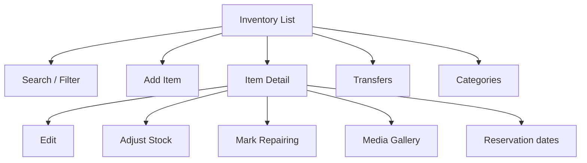
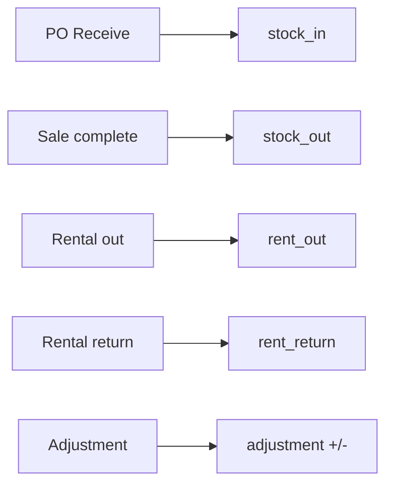

# Wireframes — Inventory

Simple stock for bridal dresses & accessories

---

## Page order

1. Inventory list  
2. Item detail  
3. Add / Edit item  
4. Stock adjust  
5. Transfer  
6. Categories / types / models (settings-lite)  
7. Reservations calendar (optional)

---

## Flow





---

## 1. Inventory list

```
┌─────────────────────────┐
│ Inventory        [ + ]  │
│ 🔍 Search name/SKU/size │
│ [All][Available][Rented]│
│ [Sale][Repair]  Filter▾ │
│─────────────────────────│
│ ┌────┐ ADF26-0042       │
│ │img │ White A-Line M   │
│ └────┘ Available · Sale │
│        12,000 AFN       │
│─────────────────────────│
│ ┌────┐ ADF26-0038       │
│ │img │ Gold Ball Gown L │
│ └────┘ Rented · until 12│
│        Rent 2,500 AFN   │
│─────────────────────────│
│ Low stock: Veils × 2    │
└─────────────────────────┘
```

**Filters:** status, purpose (sale/rental/both), category, size, branch, warehouse.

---

## 2. Item detail

```
┌─────────────────────────┐
│ ← ADF26-0042      ⋮     │
│ ┌─────────────────────┐ │
│ │   photo carousel    │ │
│ └─────────────────────┘ │
│ White A-Line Dress      │
│ Available · Size M      │
│─────────────────────────│
│ Sale     12,000 AFN     │
│ Rental    2,500 / 3 days│
│ Deposit   1,000 AFN     │
│ Cost      7,500 AFN     │
│ Qty on hand: 1          │
│ Branch: Main · WH: A    │
│─────────────────────────│
│ [ Adjust ] [ Transfer ] │
│ [ Edit ] [ Reserve ]    │
│                         │
│ Recent activity           │
│ · Rented 01 Sep — returned│
│ · Stock in from PO-12   │
└─────────────────────────┘
```

---

## 3. Add / Edit item (single scroll form)

```
┌─────────────────────────┐
│ ← New item              │
│ Photos [ + add ]        │
│ Name *                  │
│ SKU (auto) ADF26-0043   │
│ Purpose: Sale|Rent|Both │
│ Category ▾  Sub ▾       │
│ Type ▾  Model ▾         │
│ Size · Color · Fabric   │
│── Pricing ──────────────│
│ Sale price + currency   │
│ Rental price + days     │
│ Deposit · Late fee/day  │
│── Cost ─────────────────│
│ Purchase amount · other │
│ Currency · rate         │
│── Location ─────────────│
│ Branch · Warehouse      │
│ Opening qty             │
│ Description / components│
│ [ Save item ]           │
└─────────────────────────┘
```

Keep fields progressive: show rental block only if purpose includes rental.

---

## 4. Stock adjustment

```
┌─────────────────────────┐
│ ← Adjust stock          │
│ Item: White A-Line      │
│ On hand: 1              │
│ Reason ▾ Damage         │
│ Counted qty [ 0 ]       │
│ Note                    │
│ Photo (optional)        │
│ [ Post adjustment ]     │
└─────────────────────────┘
```

---

## 5. Transfer

```
┌─────────────────────────┐
│ ← Transfer        [ + ] │
│ From WH ▾ → To WH ▾     │
│ Add items…              │
│ White A-Line · qty 1    │
│ Note                    │
│ [ Send ] → in transit   │
│ [ Mark received ]       │
└─────────────────────────┘
```

---

## 6. Categories (lite settings inside Inventory)

List main categories → sub categories.  
Separate short lists for Types and Models.  
Same pattern as Settings master data.
