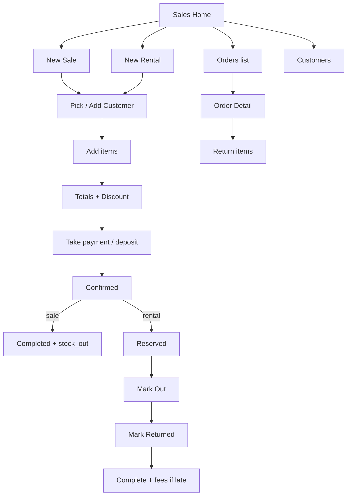
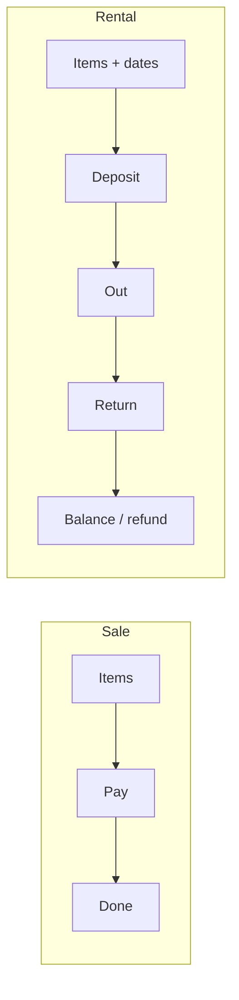

# Wireframes — Sales (Sale + Rental + Return)

Cashier-friendly · fewest taps possible

---

## Page order

1. Sales home  
2. Customer pick / add  
3. New sale checkout  
4. New rental checkout  
5. Order detail  
6. Collect payment  
7. Mark rented out / returned  
8. Sales return  
9. Customers list  

---

## Flow





---

## 1. Sales home

```
┌─────────────────────────┐
│ Sales                   │
│ Today: 5 orders · 41k   │
│─────────────────────────│
│ [ + New Sale ]          │
│ [ + New Rental ]        │
│─────────────────────────│
│ Tabs: Open | Due | Done │
│ SO-019 · Sara · Rental  │
│ Due return today · 50%  │
│ SO-018 · Maryam · Sale  │
│ Paid · 12,000           │
└─────────────────────────┘
```

---

## 2. Pick / Add customer (sheet)

```
┌─────────────────────────┐
│ Customer                │
│ 🔍 Phone or name        │
│─────────────────────────│
│ Sara · 0700… · wedding  │
│   20 Sep                │
│ Maryam · 0780…          │
│─────────────────────────│
│ [ + New customer ]      │
│ Name *  Phone *         │
│ Wedding date (optional) │
│ [ Save & use ]          │
└─────────────────────────┘
```

---

## 3. New sale checkout

```
┌─────────────────────────┐
│ ← New sale              │
│ Customer: Sara      ✎   │
│─────────────────────────│
│ Items                   │
│ [ + Add dress / item ]  │
│ White A-Line ×1  12,000 │
│ Veil set ×1       1,500 │
│─────────────────────────│
│ Subtotal        13,500  │
│ Discount         -500   │
│ Total           13,000  │
│ Pay now    [Full/Part]  │
│ Method ▾ Cash           │
│ Account ▾ Cash drawer   │
│─────────────────────────│
│ [ Complete sale ]       │
└─────────────────────────┘
```

Add item: search inventory → only `available` + purpose sale/both.

---

## 4. New rental checkout

```
┌─────────────────────────┐
│ ← New rental            │
│ Customer: Sara      ✎   │
│ Event date   20 Sep     │
│ Rent from    19 Sep     │
│ Rent to      21 Sep     │
│─────────────────────────│
│ Items                   │
│ Gold Ball Gown · L      │
│ 2,500 · dep 1,000       │
│ ⚠ Conflicts? none       │
│─────────────────────────│
│ Rental total     2,500  │
│ Deposit due      1,000  │
│ Balance later    1,500  │
│ Take deposit now [✓]    │
│ Method ▾ Cash           │
│─────────────────────────│
│ [ Confirm booking ]     │
└─────────────────────────┘
```

System blocks double-booking same dress overlapping dates.

---

## 5. Order detail

```
┌─────────────────────────┐
│ ← SO-019 · Rental       │
│ Status: Confirmed       │
│ Sara · 0700…            │
│ 19–21 Sep · Event 20    │
│─────────────────────────│
│ Gold Ball Gown   2,500  │
│ Deposit paid     1,000  │
│ Balance          1,500  │
│─────────────────────────│
│ [ Collect payment ]     │
│ [ Mark rented out ]     │
│ [ Mark returned ]       │
│ [ Print / Share ]       │
│ [ Cancel ]              │
└─────────────────────────┘
```

Return screen: condition (good / cleaning / damaged), late days → auto late fee, refund deposit remainder.

---

## 6. Sales return (sold items)

```
┌─────────────────────────┐
│ ← Return · SO-018       │
│ Select items            │
│ [✓] White A-Line ×1     │
│ Reason ▾ Customer change│
│ Restock? [✓]            │
│ Refund amount  12,000   │
│ [ Post return ]         │
└─────────────────────────┘
```
