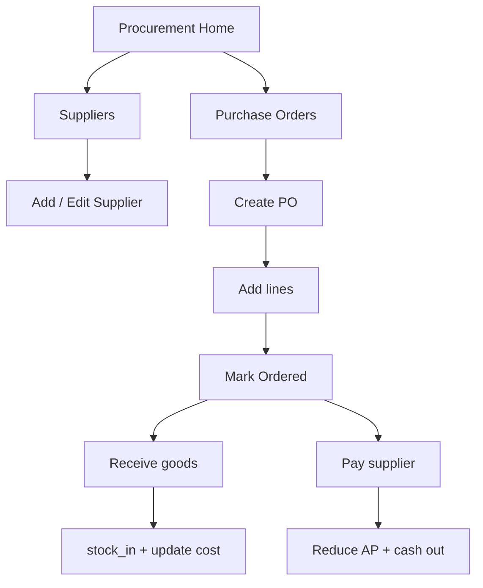

# Wireframes — Procurement (Simple)

Buy stock · receive · pay supplier — no RFQ / shipment maze

---

## Page order

1. Procurement home  
2. Suppliers list / form  
3. Purchase orders list  
4. Create PO  
5. Receive goods (GRN)  
6. Supplier payment  

---

## Flow



---

## 1. Procurement home

```
┌─────────────────────────┐
│ Procurement             │
│ Open POs: 2 · AP: 1.2k  │
│─────────────────────────│
│ [ + New purchase ]      │
│ [ Suppliers ]           │
│─────────────────────────│
│ PO-012 · Fashion Co     │
│ Ordered · due receive   │
│ PO-011 · Local Tailor   │
│ Partial · pay balance   │
└─────────────────────────┘
```

---

## 2. Suppliers

```
┌─────────────────────────┐
│ ← Suppliers       [ + ] │
│ 🔍 Search               │
│ Fashion Import Co       │
│ 0700… · Active          │
│ Kabul Local Tailor      │
│ 0780… · Active          │
└─────────────────────────┘
```

Form: name*, phone, contact, address, currency, payment term, note.

---

## 3. Create PO

```
┌─────────────────────────┐
│ ← New purchase          │
│ Supplier ▾              │
│ Branch / Warehouse ▾    │
│ Order date · Expected   │
│─────────────────────────│
│ Lines                   │
│ [ + Add item ]          │
│ New dress (create later)│
│ qty 1 · cost 7,500      │
│ Veil pack · existing    │
│ qty 10 · cost 200       │
│─────────────────────────│
│ Other cost (shipping)   │
│ Total 9,500 AFN         │
│ [ Save draft ]          │
│ [ Mark ordered ]        │
└─────────────────────────┘
```

Line can link existing inventory item OR free-text (create SKU on receive).

---

## 4. Receive goods

```
┌─────────────────────────┐
│ ← Receive · PO-012      │
│ Warehouse ▾ Main        │
│ Date: today             │
│─────────────────────────│
│ Ordered 1 · Receive [1] │
│ White gown draft name   │
│ → Create inventory item │
│   Size M · Color White  │
│ Ordered 10 · Recv [10]  │
│ Veil pack               │
│─────────────────────────│
│ [ Post receive ]        │
│ → stock increases       │
└─────────────────────────┘
```

---

## 5. Pay supplier

```
┌─────────────────────────┐
│ ← Pay supplier          │
│ PO-012 · Fashion Co     │
│ Balance due 9,500       │
│ Amount  [ 9,500 ]       │
│ Method ▾ Transfer       │
│ From account ▾ Bank     │
│ Reference / note        │
│ [ Record payment ]      │
└─────────────────────────┘
```
