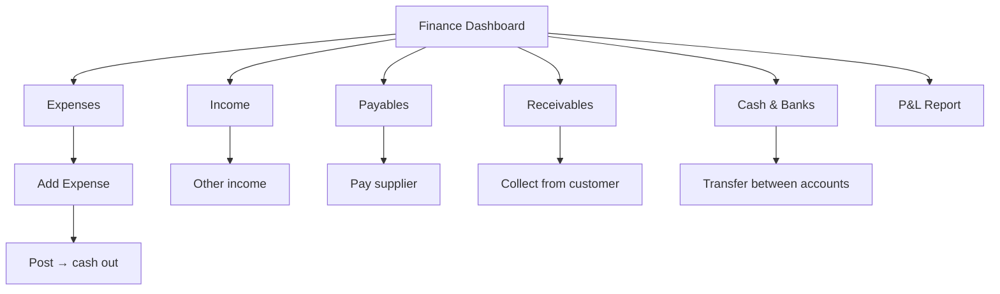
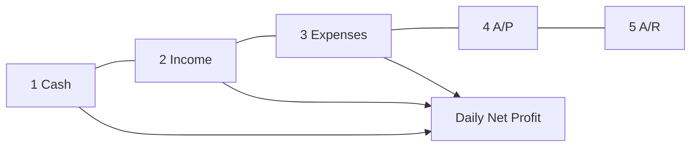

# Wireframes — Finance (5 Pillars)

Owner sees profit/loss without accounting complexity

---

## Page order

1. Finance dashboard (5 pillars)  
2. Cash & banks  
3. Income list / add other income  
4. Expenses list / add expense  
5. Payables (what we owe)  
6. Receivables (what they owe)  
7. Day / month P&L report  
8. Account transfer  

---

## Flow





---

## 1. Finance dashboard

```
┌─────────────────────────┐
│ Finance · Today ▾       │
│ Branch: All ▾           │
│─────────────────────────│
│ 1. Cash & Banks  18,200 │
│ 2. Income today   15,500│
│ 3. Expenses today  2,100│
│ 4. We owe (A/P)    1,200│
│ 5. They owe (A/R)  3,100│
│─────────────────────────│
│ Net profit today  +4,200│
│  (Income − Exp − COGS)  │
│─────────────────────────│
│ [ + Expense ]           │
│ [ + Other income ]      │
│ [ Collect A/R ]         │
│ [ Pay A/P ]             │
└─────────────────────────┘
```

Tap each pillar card → detail list.

---

## 2. Cash & banks

```
┌─────────────────────────┐
│ ← Cash & Banks    [ + ] │
│ Cash Drawer   4,200 AFN │
│ Bank Azizi   12,000 AFN │
│ Wallet        2,000 AFN │
│─────────────────────────│
│ [ Transfer ]            │
│ Recent movements        │
│ +12,000 Sale SO-018     │
│ -2,100  Expense rent    │
└─────────────────────────┘
```

---

## 3. Add expense (most used)

```
┌─────────────────────────┐
│ ← New expense           │
│ Category ▾ Shop rent    │
│ Amount *                │
│ Date · Branch           │
│ Pay from ▾ Cash drawer  │
│ Method ▾ Cash           │
│ Vendor / note           │
│ Photo receipt (opt)     │
│ [ Save expense ]        │
└─────────────────────────┘
```

---

## 4. Payables

```
┌─────────────────────────┐
│ ← We owe (A/P)          │
│ Fashion Co · 9,500 open │
│ due 15 Sep              │
│ Local Tailor · paid ✓   │
│ Tap → [ Pay ]           │
└─────────────────────────┘
```

---

## 5. Receivables

```
┌─────────────────────────┐
│ ← They owe (A/R)        │
│ Sara · SO-019 · 1,500   │
│ rental balance          │
│ Maryam · SO-015 · 3,000 │
│ Tap → [ Collect ]       │
└─────────────────────────┘
```

---

## 6. P&L report

```
┌─────────────────────────┐
│ ← Profit & Loss         │
│ Period: This month ▾    │
│─────────────────────────│
│ Sales income    120,000 │
│ Rental income    45,000 │
│ Other income      2,000 │
│ Total income    167,000 │
│ COGS            -70,000 │
│ Gross profit     97,000 │
│ Expenses        -28,000 │
│ Net profit       69,000 │
│─────────────────────────│
│ [ Share / Export ]      │
└─────────────────────────┘
```
